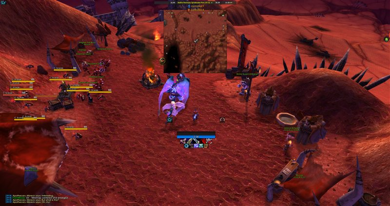
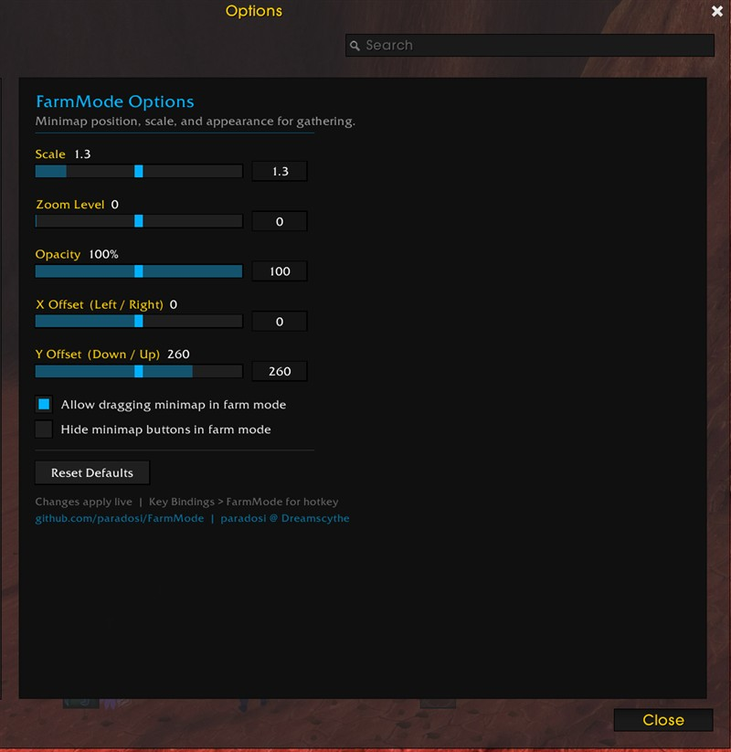

# FarmMode

A lightweight WoW addon that centers and enlarges the minimap for easier gathering routes.

Type `/farm` to toggle. Type `/farm config` for settings.

## Screenshots

**Farm Mode Off** — default minimap position

**Farm Mode On** — minimap centered and enlarged

**Settings Panel** — `/farm config`

## Features

- Configurable scale, zoom, opacity, and position
- Draggable minimap while in farm mode
- Hide minimap clutter (zoom buttons, tracking, zone text)
- Key binding support (Key Bindings > FarmMode)
- ElvUI-styled settings panel
- Settings persist across sessions

## Install

1. Download the latest release
2. Extract the `FarmMode` folder into `World of Warcraft\_anniversary_\Interface\AddOns\`
3. Restart WoW or `/reload`

## Usage

- `/farm` — Toggle farm mode on/off
- `/farm config` — Open settings panel

## Compatibility

- WoW TBC Classic Anniversary (Interface 20505)

## License

[MIT](LICENSE)
