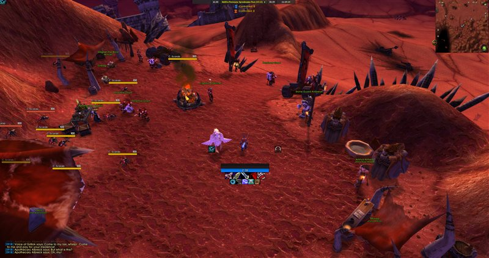

# FarmMode

A lightweight WoW addon that centers and enlarges the minimap for easier gathering routes.

Type `/farm` to toggle. Type `/farm` again to restore.

## Screenshots

**Farm Mode Off** — default minimap position

**Farm Mode On** — minimap centered and enlarged

## Install

1. Download the latest release
2. Extract the `FarmMode` folder into `World of Warcraft\_anniversary_\Interface\AddOns\`
3. Restart WoW or `/reload`

## Usage

- `/farm` — Toggle farm mode on/off
- `/farm config` — Open settings panel

## Settings

Open with `/farm config` or via Interface > AddOns > FarmMode.

- **Scale** — Minimap size (1.0x to 3.0x)
- **Zoom Level** — Minimap zoom (0 = zoomed out, 5 = zoomed in)
- **Opacity** — Minimap transparency (30% to 100%)
- **X / Y Offset** — Position on screen
- **Draggable** — Left-click drag the minimap to reposition while in farm mode (smooth, snap-free cursor tracking)
- **Hide Clutter** — Hides minimap buttons (zoom, tracking, zone text) for a clean view
- **Reset Defaults** — Restore all settings to defaults

All sliders are ElvUI-styled with mouse wheel support. Settings persist across sessions and apply live.

## Keybinding

Bind a hotkey in **Options > Keybindings > FarmMode** to toggle without typing `/farm`.

## Compatibility

- WoW TBC Classic Anniversary (Interface 20505)
- v1.3

## License

[MIT](LICENSE)
